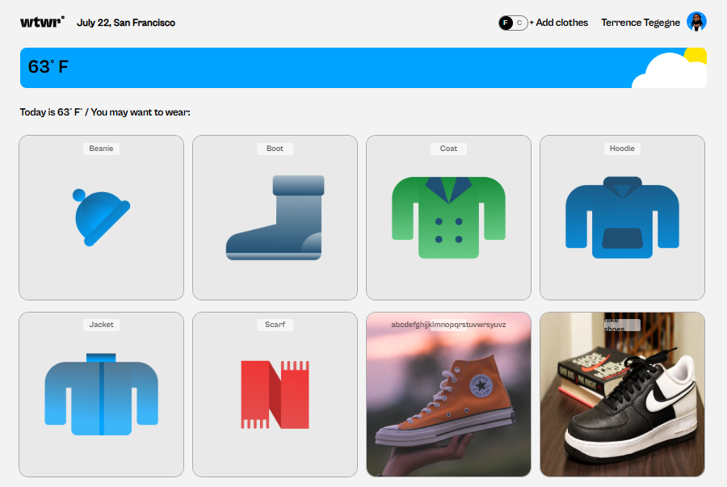

# WTWR (What to Wear?) - Smart Weather-Based Clothing Recommendations

A React application that solves the daily dilemma of choosing appropriate clothing by analyzing real-time weather data and recommending suitable items from your personal wardrobe.



## 🌐 Live Demo
[View Live Application](https://huntermelrose.dev/wtwr)

## 🎯 Project Vision

WTWR was born from a personal frustration we all share: staring at our closets every morning, unsure what to wear for the day's weather. As I transitioned from vanilla JavaScript to React, I wanted to build something practical that would showcase modern frontend development while solving a real-world problem.

### Why I Built This
- **Real Problem Solving**: Eliminate the guesswork in daily clothing decisions
- **React Mastery**: Demonstrate proficiency with modern React patterns and component architecture
- **API Integration**: Show ability to work with external data sources and handle asynchronous operations
- **User Experience Focus**: Create an intuitive interface that makes complex decisions simple

## ✨ Key Features

- **🌤️ Real-Time Weather Integration**: Fetches current weather conditions from Weather API
- **🧥 Smart Recommendations**: Automatically filters clothing based on temperature and conditions
- **👕 Personal Wardrobe Management**: Add, organize, and manage your clothing collection
- **📱 Responsive Design**: Seamless experience across desktop, tablet, and mobile
- **🎨 Interactive UI**: Modern modal interfaces and smooth user interactions
- **⚡ Fast Performance**: Optimized with Vite for lightning-fast development and builds

## 🛠️ Technical Architecture

### Core Technologies
- **React 18**: Modern frontend framework with hooks and functional components
- **Vite**: Next-generation build tool for faster development
- **CSS3**: Custom styling with modern layout techniques
- **JavaScript ES6+**: Modern syntax and features throughout
- **Weather API**: Real-time meteorological data integration

### Technical Highlights
- **Component-Based Architecture**: Modular, reusable components for maintainable code
- **React Hooks**: useState and useEffect for efficient state management
- **API Integration**: Robust weather data fetching with error handling
- **Responsive Design**: Mobile-first approach with flexible layouts
- **Modal System**: Clean, accessible popup interfaces

## 🏗️ Component Architecture

```
src/
├── components/
│   ├── App/              # Main application logic and state
│   ├── Header/           # Navigation and branding
│   ├── Main/             # Weather display and clothing grid
│   ├── ItemCard/         # Individual clothing item display
│   ├── ItemModal/        # Detailed item view popup
│   ├── ModalWithForm/    # Add new item interface
│   └── Footer/           # Application footer
├── utils/               # API calls and helper functions
└── assets/             # Images and static resources
```


## 🔧 Development Challenges & Solutions

### Challenge 1: State Management Across Components
**Problem**: Managing weather data, clothing items, and modal states across multiple components
**Solution**: Implemented centralized state management in the App component with props drilling, preparing foundation for future Context API or Redux integration

### Challenge 2: API Integration and Error Handling
**Problem**: Handling weather API responses, loading states, and potential network failures
**Solution**: Created robust error handling with user-friendly fallbacks and loading indicators

### Challenge 3: Dynamic Clothing Recommendations
**Problem**: Creating intelligent filtering logic based on temperature ranges and weather conditions
**Solution**: Developed a recommendation algorithm that maps weather conditions to appropriate clothing categories

### Challenge 4: Responsive Modal Interfaces
**Problem**: Creating accessible, mobile-friendly modal components
**Solution**: Built reusable modal system with proper focus management and responsive design

## 📱 User Experience Design

### Weather-Based Intelligence
The app analyzes current temperature and conditions to automatically show relevant clothing options, removing the mental overhead of weather-appropriate decisions.

### Intuitive Interactions
- **One-Click Adding**: Streamlined process for adding new clothing items
- **Visual Feedback**: Clear loading states and success confirmations
- **Touch-Friendly**: Optimized for mobile interactions

### Responsive Excellence
- **Mobile-First**: Designed for mobile users, enhanced for desktop
- **Flexible Layouts**: Components adapt gracefully to any screen size
- **Performance Optimized**: Fast loading across all devices

## 📈 What I Learned

### Technical Growth
- **React Fundamentals**: Mastered component lifecycle, hooks, and modern patterns
- **State Management**: Understanding when and how to lift state up
- **API Integration**: Real-world experience with external data sources
- **Build Tools**: Leveraging Vite for improved development experience

### Development Skills
- **Component Design**: Creating reusable, maintainable code structures
- **User-Centered Thinking**: Designing features based on real user needs
- **Problem Decomposition**: Breaking complex features into manageable components
- **Modern Workflows**: Using contemporary tools and development practices

## 🔮 Future Enhancements

### Phase 1: Backend Integration
- User authentication and personal accounts
- Cloud-based wardrobe storage
- Cross-device synchronization

### Phase 2: Advanced Features
- 7-day weather forecasting with outfit planning
- Outfit combination suggestions
- Social sharing and style recommendations

### Phase 3: Intelligence Upgrades
- Machine learning for personalized recommendations
- Seasonal wardrobe organization
- Weather pattern analysis

## 🏆 Project Impact

This project represents my transition into modern React development, demonstrating:
- **Technical Proficiency**: Solid understanding of React ecosystem
- **Problem-Solving Approach**: Building solutions for real-world challenges
- **Growth Mindset**: Continuous learning and improvement
- **Professional Development**: Writing maintainable, scalable code


## 📄 License

This project is open source and available under the [MIT License](LICENSE).

---

*Developed as part of my React learning journey - transforming weather data into smart clothing decisions* 🌤️👕

**Built with React • Powered by Weather API • Designed for Daily Use**
